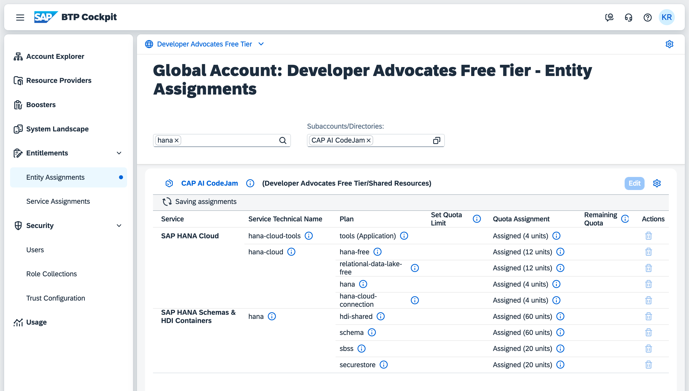
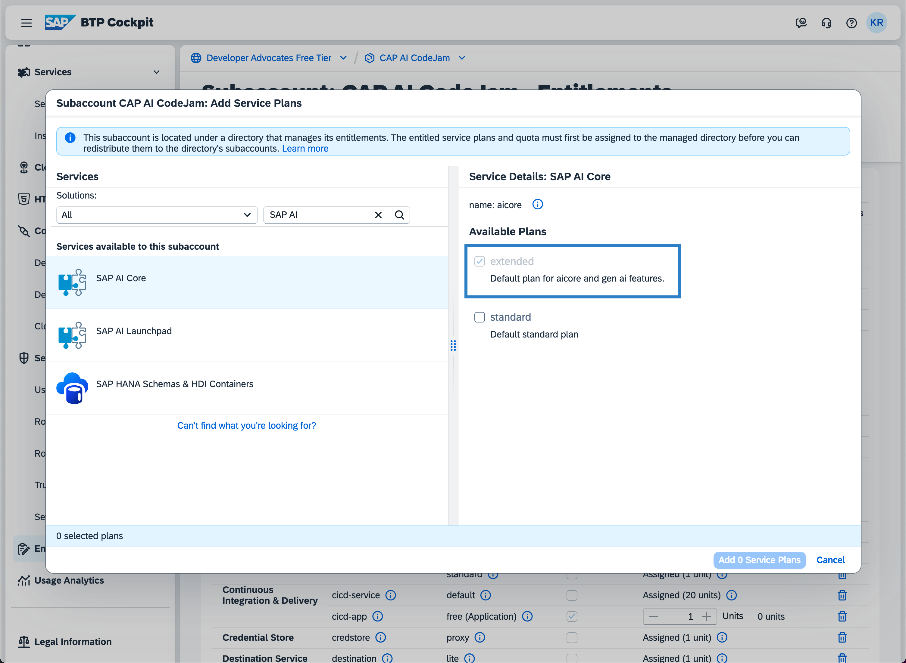
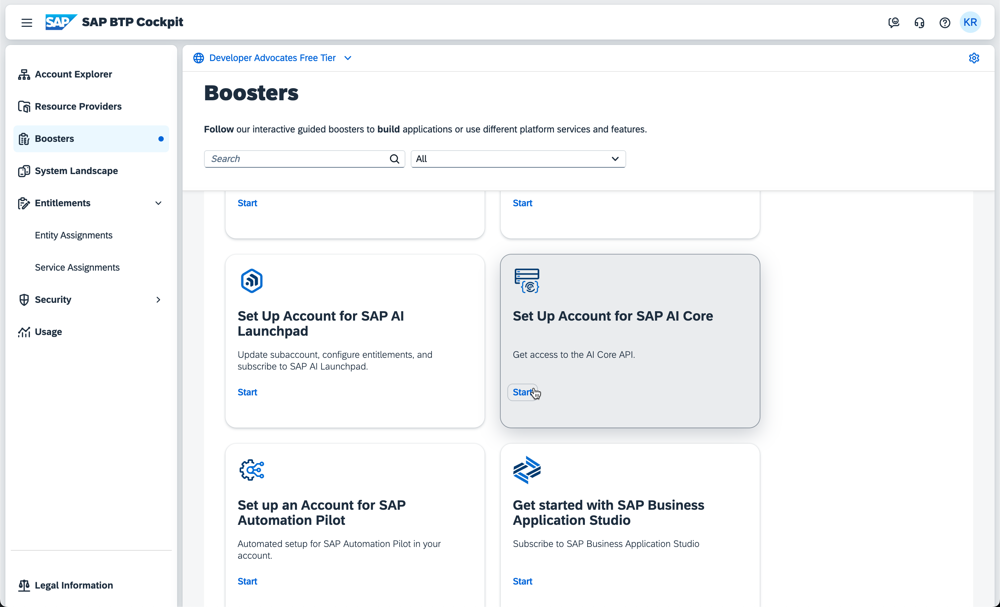
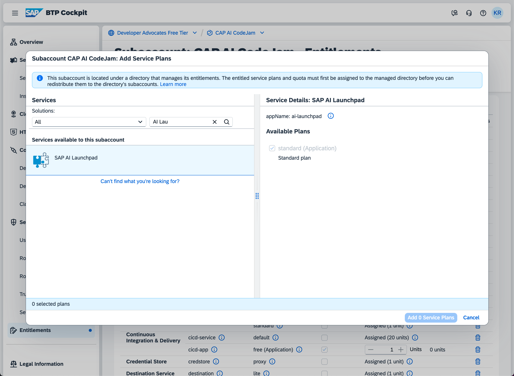
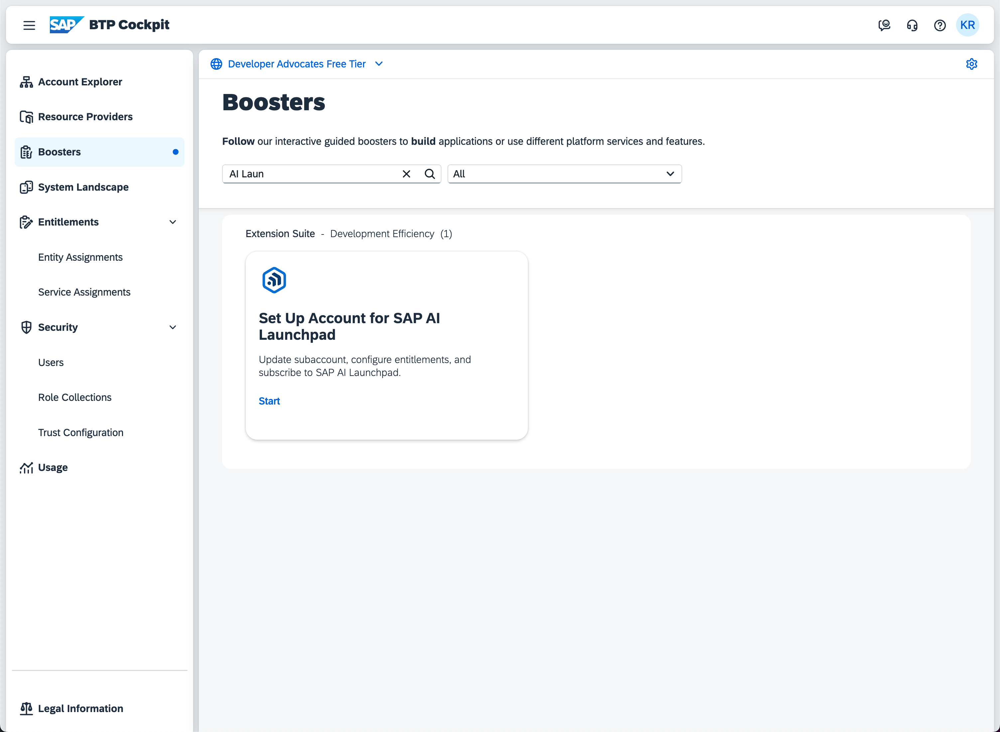
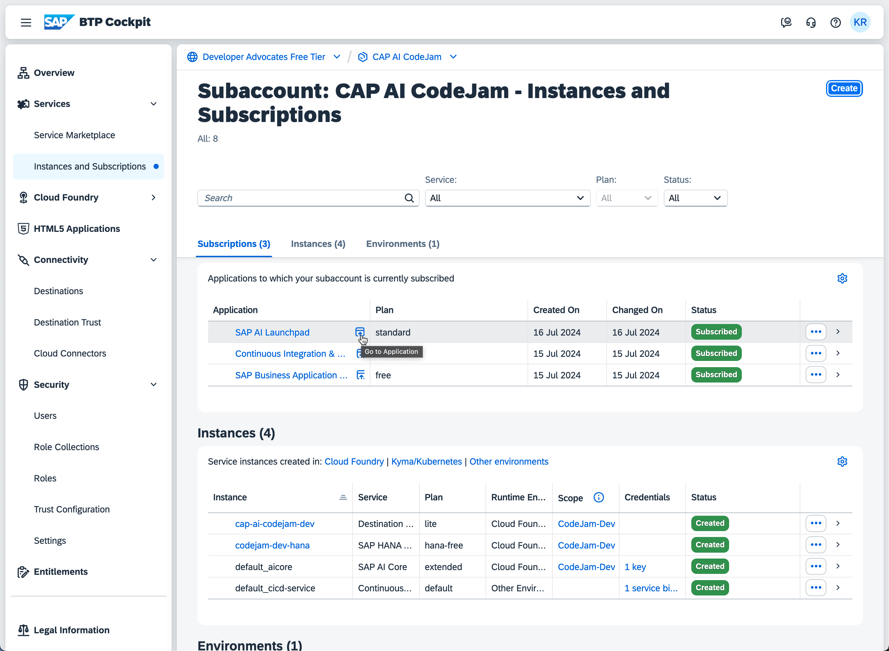
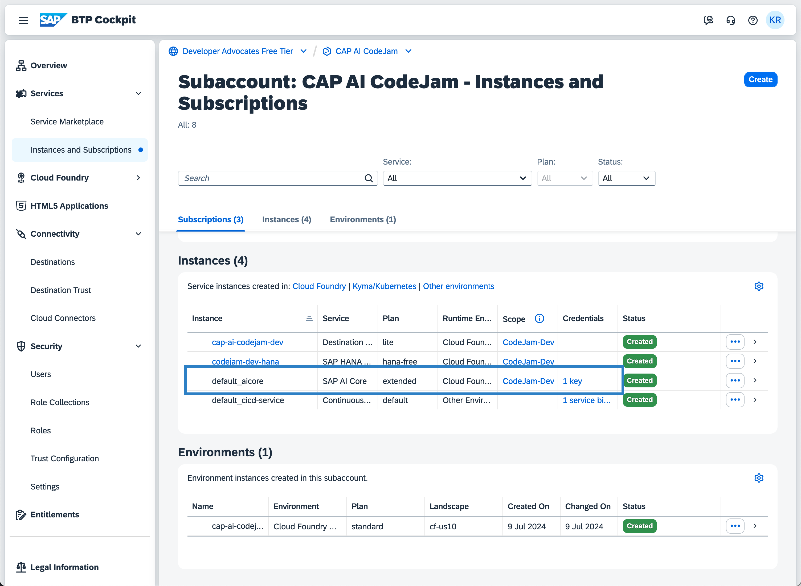
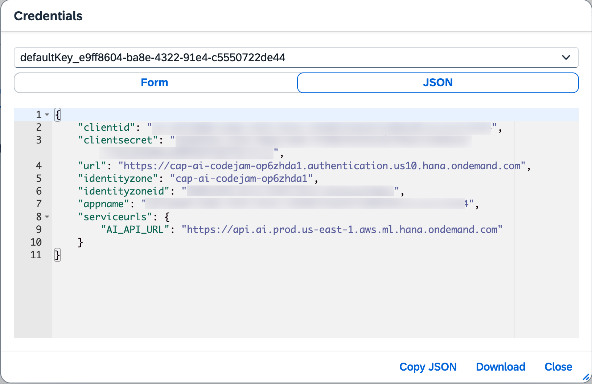

# How to set up SAP Business Technology Platform for the development of SAP Cloud Application Programming model and SAP AI Core

Suppose you want to develop SAP Cloud Application Programming model applications to consume and expose the capabilities of SAP AI Core. In that case, you must set up and connect the services the SAP Business Technology Platform provides. This whole setup process can seem complex and overwhelming, but this guide will help you understand all the moving pieces, taking out the complexity.

The SAP Business Technology Platform, short BTP, is the platform in which all these services live. BTP will help you manage service instances, entitlements, user profiles, rights, and complete development environments. BTP is a Platform as a Service (PaaS) running on top of a hyperscaler like Google Cloud Platform or Amazon Web Services and SAP's data centers.

You can initialize a BTP account and, subsequently, a subaccount in different global regions. Choosing a region makes sense because you want the service instances used close to your location. In our case, where we are using the Free Tier instance of BTP, the region is crucial to the availability of functionalities. Free Tier is a perfect fit for what we want to do because it allows us to go from an exploration phase to production without changing the landscape or even the whole account. A simple upgrade is all we need. SAP AI Core is available in the Free Tier account, but the generative AI hub on SAP AI Core, which we need to access LLMs, is only available over the `extended` service plan. For this CodeJam, SAP provides the extended service.

Nothing described in this guide needs to be done by you as a CodeJam participant. We will provide you with a fully functioning environment, but this can be helpful if you want to replicate what you have learned at home.

If you want to learn more about BTP, regions, Free Tier, and the account structure of BTP, a list of additional resources is provided below:

* [SAP Business Technology Platform](https://www.sap.com/products/technology-platform.html)
* [Try and buy SAP Business Technology Platform](https://www.sap.com/products/technology-platform/pricing.html)
* [Get started with SAP Business Technology Platform](https://help.sap.com/docs/btp/sap-business-technology-platform/sap-business-technology-platform)
* [Regions](https://help.sap.com/docs/btp/sap-business-technology-platform/regions)

## Enable SAP BTP, Cloud Foundry runtime, and create a development space

Working with BTP allows us to create and start a runtime environment to start service instances, develop applications, and deploy them. BTP provides two different options as runtimes: a runtime allowing for working directly with Kubernetes without much abstraction, providing full access and power over how services run, and one that is also running Kubernetes underneath but gives a nice abstraction layer on top that makes development and deployment easier but takes away a lot of the fine-granular administration you would get with a pure Kubernetes instance. The first is called SAP BTP, Kyma runtime, and the latter is SAP BTP, Cloud Foundry runtime. We will progress with the SAP BTP, Cloud Foundry runtime (CF) for our purpose.

Within a CF instance, we can create a _Space_. A _Space_ provides users access to a shared app development, deployment, and maintenance location. You can have multiple spaces if needed.

Let's follow the steps to set up a CF runtime and create a development space within the sub-account.

1. Go to your sub-account, and on the overview page, click on `Enable Cloud Foundry.`

2. Select the `standard` plan and click `create.`

3. Click `Create Space` within your subaccount's `Cloud Foundry Environment` section.

## Enable and create an instance of SAP HANA Cloud

In the scenario implemented in this CodeJam, SAP HANA Cloud is being used to store the created vector embeddings. SAP HANA Cloud has a vector database built into it, the SAP HANA Cloud Vector Engine.

The creation of the instance needs the correct service quota within the proper entitlement.

Finally, the service can be created via the `Instances and Subscriptions` screen.

How to enable and create a SAP HANA Cloud instance is described in the following tutorial:

* 
* 
* 

Make sure you have the `SAP HANA Cloud` instance as well as the `SAP HANA Administration Tools` entitled and created in your subaccount. The tools will provide your subaccount with the correct role collection and administrative tools to manage your SAP HANA Cloud instance. If you use the `Set Up SAP HANA Cloud Administration Tools` booster, you get all the tools including the role collections set up automatically. If you want to enable the tools manually, you can add the `SAP HANA Cloud` entitlement using the `hana-cloud-tools` service plan. After you have entitled your subaccount, you can create an instance of the administration tools via the service marketplace. That will provide the necessary role collections to your subaccount. The role collections need to be assigned to your user manually.

Now, that you have a SAP HANA Cloud instance up and running, we can utilize the Vector Engine. The Vector Engine is part of a new SAP HANA Cloud database instance, and a vector is just another datatype that can be created and used like any other datatype for SAP HANA DB.

For information, you can read up on the following resources:

* [SAP HANA Cloud, SAP HANA Database Vector Engine Guide](https://help.sap.com/docs/hana-cloud-database/sap-hana-cloud-sap-hana-database-vector-engine-guide/introduction)
* [SAP HANA Cloud, SAP HANA Database](https://help.sap.com/docs/hana-cloud-database)

If you're interested in a CodeJam covering CAP application development for SAP HANA Cloud, you can visit the GitHub repository for that CodeJam.

* [GitHub: cap-hana-exercises-codejam](https://github.com/SAP-samples/cap-hana-exercises-codejam/tree/main)

## Enable and create an instance of SAP Business Application Studio

The SAP Business Application Studio is an IDE based on Visual Studio coded available on and through BTP. It can be created and entitled like any other service on BTP. A considerable benefit of a local Visual Studio installment is that you can use it from any modern browser, and the environment is set up for development.

You can find a detailed guide here:

* [Set Up SAP Business Application Studio for Development](https://developers.sap.com/tutorials/appstudio-onboarding.html)

## Enable and create an instance of SAP AI Core

SAP AI Core is available through the Free Tier plan on BTP and can be simply enabled by assigning the correct entitlement and then going to the Service Marketplace to create an instance.

1. Click `Entitlements` on the left-hand navigation within your subaccount.

2. Click on `Edit` in the Entitlements screen.

3. Click on `Add Service Plans.`

4. Search for `SAP AI Core` via the search field, click `SAP AI Core,` and check the box `extended` as a service plan.

5. Click on `Add Service Plans.`

> Alternatively, you can go to your global account and use the Booster for SAP AI Core. Be aware that the booster will check for an existing CF instance; if one exists, the booster won't work. The booster saves you the creation of an example for SAP AI Core so that you can skip the next steps.

The entitlement is added to your account, which enables you to create a service instance of the SAP AI Core extended service plan.

1. Click `Service Marketplace` on the left-hand navigation within your subaccount.

2. Search for `SAP AI Core` via the search field, and select `SAP AI Core.`

3. Click on `Create` in the appearing view.

4. In the pop-up window, enter a CLI-friendly name and click `Create.`

The service creation will take a second before it appears in the `Instances and Subscriptions` view.

## Enable and create an instance of SAP AI Launchpad

An instance of SAP AI Launchpad is required to interact with and manage SAP AI Core. We follow the same procedure: add the correct entitlement to the subaccount and create a service instance based on that.

1. Click `Entitlements` on the left-hand navigation within your subaccount.

2. Click on `Edit` in the Entitlements screen.

3. Click on `Add Service Plans.`

4. Search for `SAP AI Launchpad` via the search field and select `SAP AI Launchpad.`

5. Click on `Add Service Plans.`

> Alternatively, you can go to your global account and use the Booster for SAP AI Launchpad. The booster saves you the creation of an instance for SAP AI Launchpad so you can skip the next steps.

With the correct entitlement in place, you can use the Service Marketplace to create an instance of SAP AI Launchpad.

1. Click `Service Marketplace` on the left-hand navigation within your subaccount.

2. Search for `SAP AI Core` via the search field, and select `SAP AI Core.`

3. Click on `Create` in the appearing view.

The service creation will take a second before it appears in the `Instances and Subscriptions` view.

## Setup the SAP AI Launchpad service

In the last step, you have entitled your subaccount to use the SAP AI Launchpad service and created an instance. We will launch the SAP AI Launchpad UI and set it up for usage with SAP AI Core.

1. Open the `Services & Subscriptions` view via the left-hand navigation within your subaccount.

2. Click on the small icon next to the `SAP AI Launchpad` application to open it in a new window.

As you can see, you see nothing. You must set up an AI API Connection to access an actual workspace. 

3. Click on `Add`.

A new pop-up window will appear. You have to enter some connection details here. The form allows uploading a service key, so let's download it first.

4. Return to the `Instances and Subscriptions` view and click on the service key of the `default_aicore` instance (name might vary).

5. Download the service key.

6. Return to the `SAP AI Launchpad application and upload the service key to the configuration form.

7. Click on `Create`.

> In case the import of the service key fails, you have to manually enter the values of the service key into the configuration.

## Enable the SAP BTP Destination Service

BTP can route requests to different services provided by BTP, your own, and even on-premise systems. For that, it uses the Destination Service. A destination is a configuration file written in JSON with information about the target URL and authentication information. It is convenient because it allows for simple routing of requests towards a system without bothering about authentication against that system. The destination also specifies who can use the destination to make the whole end-to-end connection secure.

A destination can be configured on different levels within BTP, but for this use case, destinations get created within the Destination Service for a given subaccount.

A quota must be assigned to the subaccount before enablement for the Destination Service. A quota can be created via the Entitlements section.

1. Click `Entitlements` on the left-hand navigation within your subaccount.

2. Click on `Edit` in the Entitlements screen.

3. Click on `Add Service Plans.`

4. Search for `Destination Service` via the search field and click `Add Service Plans.` This service is free to use.

