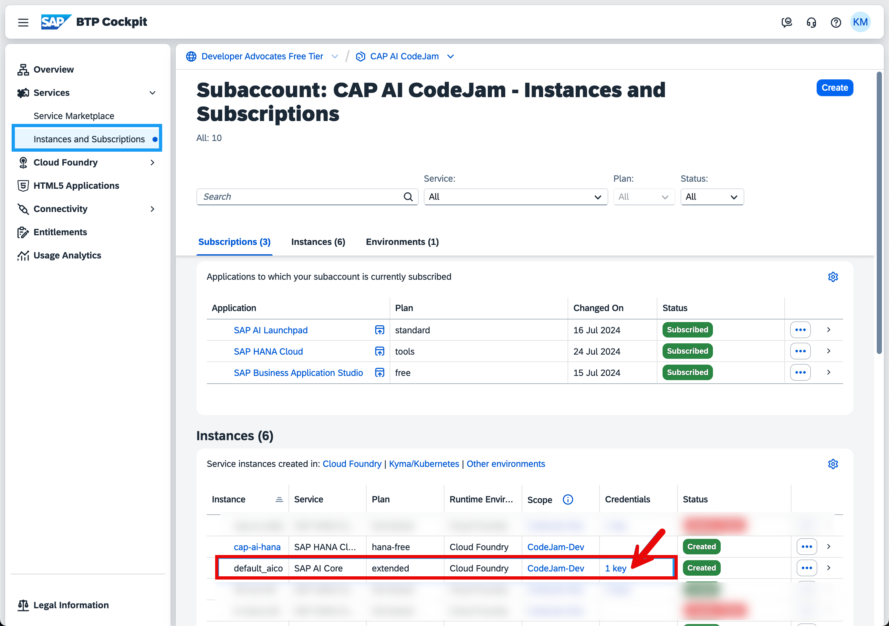
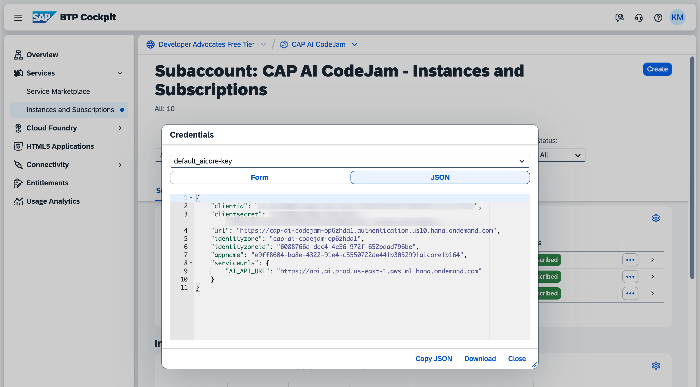

# Exercise 03 - Create the SAP AI Core connection configuration

Using the SAP Cloud SDK for AI allows you to seamlessly connect to SAP AI Core, SAP Generative AI Hub, and the Orchestration service. The SDK is available for different programming languages like Python, JavaScript, Java, and ABAP. In this Codejam you will use the JavaScript version to complement a CAP OData service with AI functionality using the SAP Generative AI Hub and Orchestration service.

In this exercise you will learn:

- How to define an environment variable for the SAP Cloud SDK for AI connection.

## Understand how the SAP Cloud SDK for AI establishes connection to SAP AI Core

To establish a connection from your CAP application to each of the AI relevant service instances within SAP BTP, a connection configuration needs to be made. With the SAP Cloud SDK for AI, you have two options to do so.

- For testing and local development purposes, you can configure a Cloud Foundry service key for SAP AI Core, in the `.env` file or as environment variable. The SDK parses the service key from the environment variable to interact with the AI Core service. This setup enables local testing of clients such as Orchestration and OpenAI, provided that deployments for orchestration and OpenAI exist in SAP BTP.

- For production, the SDK recommends creating a binding between your application and the SAP AI Core service instance. The binding is more secure as it is not exposing the authentication details in clear text.

For this Codejam you will use the first approach by providing the needed configuration details via the `.env` file. You can find the details for the configuration in the service key for the SAP AI Core instance. The authentication details are only valid during the duration of this CodeJam and will be invalidated immediately afterward.

## Inspect the .env file

👉 Go ahead and open the [.env](../../project/job-posting-service/.env)

You can see that the `AICORE_SERVICE_KEY` is a JSON object that contains four necessary fields:

- **clientid**: The client ID for the OAuth authentication flow, Client Credentials.
- **clientsecret**: The client secret for the OAuth authentication flow, Client Credentials.
- **url**: The OAuth authentication URL. You need to add `/oauth/token` at the end of the URL to direct to the OAuth token server.
- **serviceurls**:**AI_API_URL**: The SAP AI Core service URLs.

👉 Fill in the information needed using the service key of the AI Core instance.



👉 Click on the service key to display the details:



Alternatively, you can try the path of binding your application to the AI Core instance. If you go this route, you need to delete the `.env` file first.

Before you execute the command below, make sure to open a new Terminal and run the Cloud Foundry login:

👉 Open a new terminal if not already open.

👉 Log into SAP BTP using the Cloud Foundry CLI:

> NOTE: If you are part of the SAP Surge event use the `https://api.cf.eu10.hana.ondemand.com` endpoint instead of the one listed below.

```bash
cf login -a https://api.cf.us10.hana.ondemand.com
```

Or if you want to use the SSO login option:

```bash
cf login -a https://api.cf.us10.hana.ondemand.com --sso
```

👉 Now, run the binding command:

```bash
cds bind -2 default_aicore
```

That will cause Cloud Foundry to create a new service key for the SAP AI Core instance on the BTP subaccount, and configure that service key within your project. This is basically the same thing as the `.env` approach with one major difference; It is referencing the service key rather than having it clear text in your configuration.

## Summary

At this point you have set up your workspace, worked with SAP AI Launchpad by creating a resource group, deployed a model and explored other capabilities. You also learned how to define a connection to SAP AI Core for local development and testing.

In the next exercise you will start implementing the actual CAP service by defining the database schema.

### Questions for Discussion

1. What is the SAP Cloud SDK for AI, and how does it help connect to SAP AI Core?
<details><summary>Answer</summary>
   The SAP Cloud SDK for AI enables seamless integration with SAP AI Core, SAP Generative AI Hub, and the Orchestration service. It is available for multiple programming languages such as Python, JavaScript, Java, and ABAP. In this exercise, you'll use the JavaScript version to connect a CAP OData service to SAP AI functionality. The SDK helps in establishing the connection by reading authentication details from a service key or environment variables.
   </details>

2. What are the two options for configuring the connection to SAP AI Core with the SAP Cloud SDK for AI?
<details><summary>Answer</summary>

There are two ways to configure the connection:

   - For local development/testing: You can use a Cloud Foundry service key stored in the `.env` file or set it as an environment variable. This allows the SDK to parse the service key and connect to SAP AI Core for local testing, assuming the relevant AI services are deployed.

   - For production: The SDK recommends creating a binding between your application and the SAP AI Core service instance. This method is more secure, as it does not expose sensitive authentication details in clear text.
   </details>
---

[Next exercise](../04-explore-sap-hana-cloud-vector-engine/README.md)
