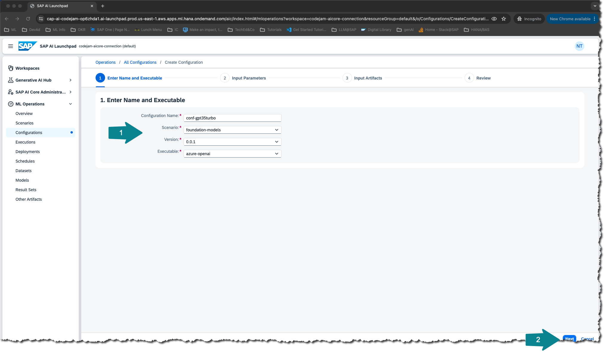
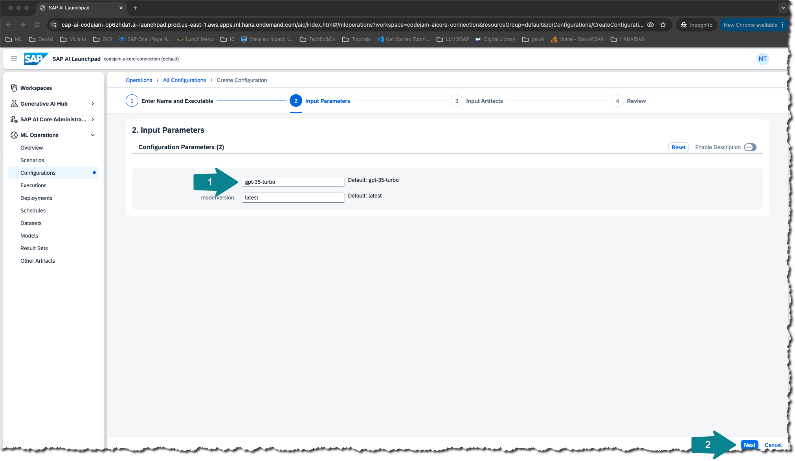
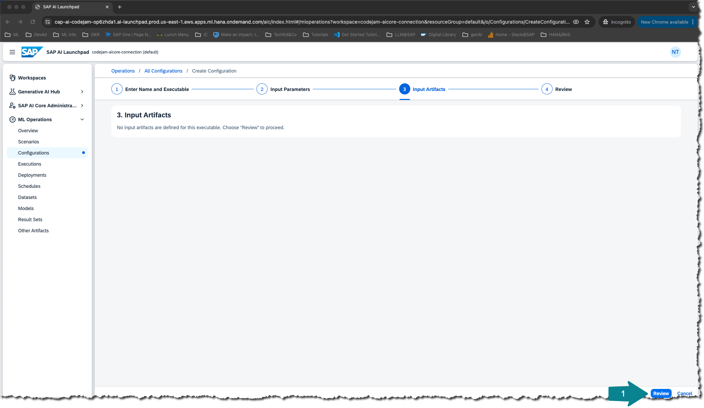
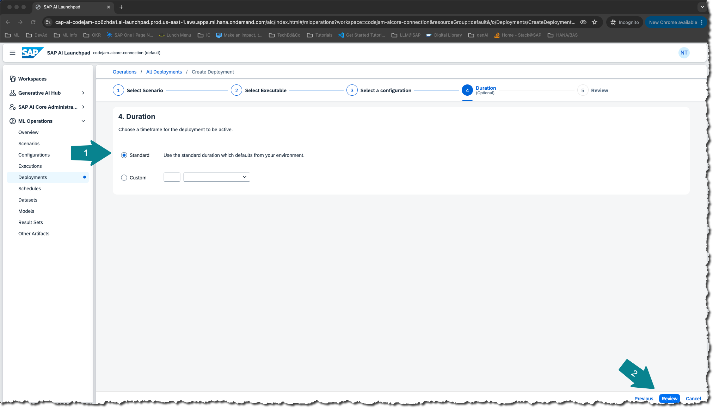
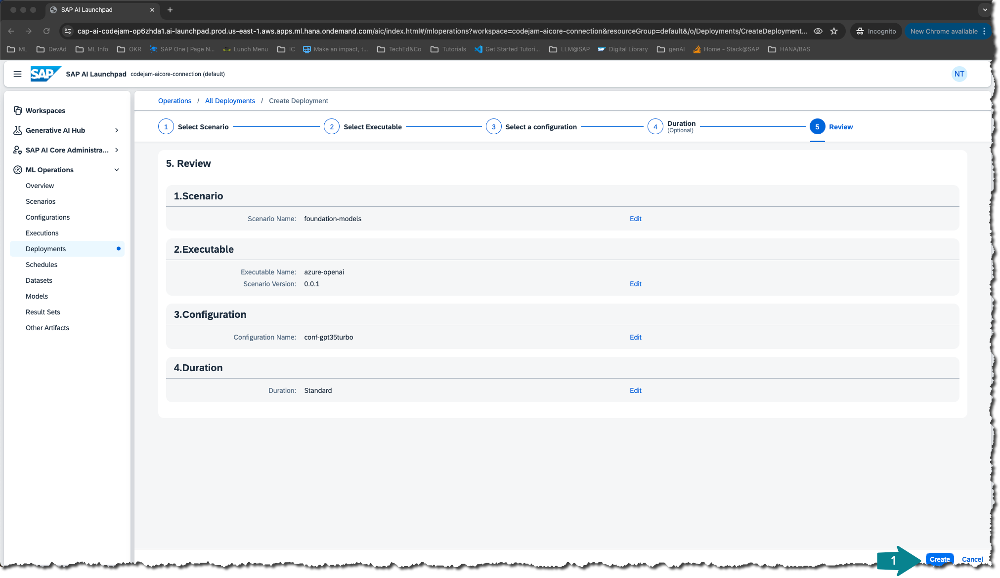
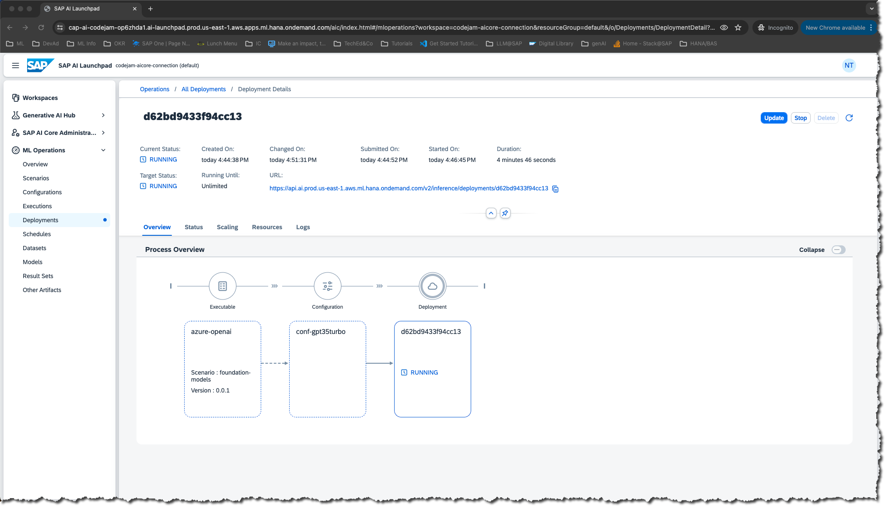

# Exercise 03 - deploy a Large Language Model with Generative AI Hub on SAP AI Core

## Open SAP AI Launchpad
👉 Go to your BTP subaccount *CAP AI CodeJam*. Navigate to Instances and Subscriptions and select SAP AI Launchpad from the Subscriptions.


## Create a new resource group for your team
👉 Make sure to create a new resource group for your team. DO NOT USE THE DEFAULT RESOURCE GROUP!


👉 Select your resource group. If the refresh on the page does not work, refresh it using the browser refresh.


## Create a configuration to deploy a proxy for a large language model on SAP AI Core

👉 Open the ML Operations tab, go to Scenarios and select the foundation-models scenario. This is the only pre-configered scenario from SAP. For all other custom machine learning models you would need to create your own scenario.


👉 Select the Executables tab and then the serving executable azure-openai to see the available Azure OpenAI models.


👉 Copy the name of the model you want to deploy the proxy for. In this CodeJam you will use gpt-4.
After that, you will create a configuration.


👉 Create a new configuration.


👉 Enter a configuration name of your choice, select the foundation-models scenrario, version and the executable azure-openai. Click next.



👉 Paste the model name gpt-4 into the modelName field and click next.

```sh
gpt-34
```



👉 Click Review on the bottom of the page.



👉 Review the configuration and click create.


## Deploy a proxy for a large language model on SAP AI Core

👉 Click on Create Deployment to create a deployment for that configuration. This will not actually deploy the model but it will deploy a proxy that will return a URL for you to use to query the large language model you specified in the configuration.


👉 For the duration select Standard. You can also select Custom to have the deployment available for a limited time. Click Review.



👉 Click Create.



Once the deployment is running you will receive a URL to query the model. Refresh the page until the URL appears. This can take a couple of minutes.


Using the URL and the client id and the client secret from the SAP AI Core service key, you could now already query the model using any programming language or any API platform.



## Deploy a proxy for an embedding model on SAP AI Core
👉 To implement a retrieval augmented generation (RAG) use case you also need to deploy an embedding model. The embeddings for our text chunks will then be stored in a vector database (e.g. HANA Vector Store). To deploy the embedding model repeat the steps above using the model name: 
```sh
text-embedding-ada-002
```
## Summary

At this point ...

## Further reading

* ...

---

## Questions

If you finish earlier than your fellow participants, you might like to ponder these questions. There isn't always a single correct answer and there are no prizes - they're just to give you something else to think about.

---

[Next exercise](../04-create-resource-group/README.md)