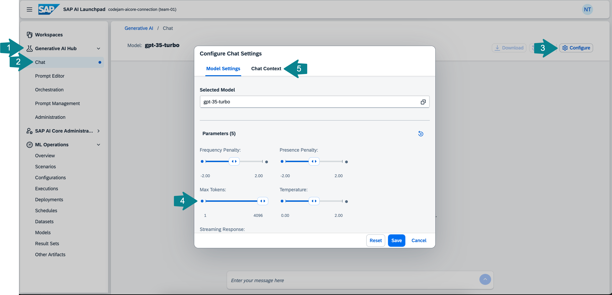
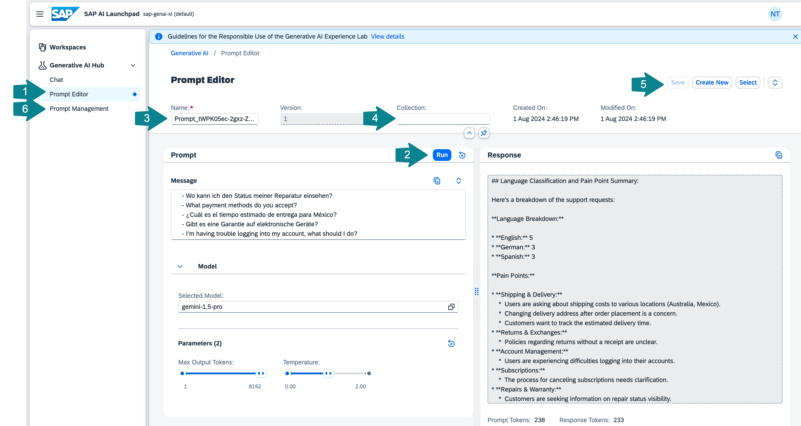

# Exercise 03 - Explore Generative AI Hub in SAP AI Launchpad

In order to leverage large language models (LLMs) or foundation models in your applications you can use the Generative AI Hub on SAP AI Core. Like most other LLM applications, Generative AI Hub is pay-per-use. You can switch between them and compare results and pick the model for your use case that works best. SAP has strict data privacy contracts with LLM providers to ensure that your data is safe.

You can access your deployed models either using the Python SDK, the cap-llm-plugin, any programming language or API platform or you can use the user interface in SAP AI Launchpad. We offer the **Chat** interface or the **Prompt Editor** where you can also save prompts and the model's responses. At SAP, every employee can access an SAP AI Launchpad and query all of the available models.

## Use the Chat in Generative AI Hub

👉 Open the **Generative AI Hub** tab and select **Chat**.

👉 Click **Configure** and have a look at the available fields.

Under **Selected Model** you will find all the deployed models. If there is no deployment, this will be empty and you will not be able to chat. If you have more than one large language model deployed you will be able to select which one you want to use here.

The parameter **Frequency Penalty** allows you to penalize words that appear too frequently in the text, leading to the model not sounding too robotic.

Similarly, the higher the **Presence Penalty**, the more likely the model will talk about new topics, as you penalize words that have appeared in the text so far.

With **Max Tokens**, you can set the size of the input and output of the model. Where tokens are not words but rather 4-5 characters long.

With the **Temperature** parameter you can set how creative the model should sound so flexible the model is allowed to be in selecting the next token in the sequence.

👉 Increase **Max Tokens** to the maximum amount by pulling the slide bar all the way to the right.



In the **Chat Context** tab right under **Context History**, you can set the number of messages that should be send to the model. So how much of the chat history should be provided as context to the model for each new request. You can add a **System Message** to describe the role or give more information of what is expected from the model. You can also provide example inputs and outputs.


## Prompt Engineering

👉 Try out different prompt engineering techniques following these examples:

1. Zero shot:
   ```
    The capital of the U.S. is:
   ```
2. Few shot:
   ```
   Germany - Berlin
   France - Paris
   U.S. -
   ```
3. Chain of thought:
   ```
   1. What is the most important city of a country?
   2. In which country was the Internet originally developed?
   3. What is the >fill in the word from step 1< of the country >fill in the word from step 2<.
   ```

👉 Try to add something funny to the **System Message** like `always respond like a pirate` and try the prompts again. You can also ask it to speak more technical like a developer or rather shiny like Marketing.

## Use the Prompt Editor in Generative AI Hub

The **Prompt Editor** is useful if you want to store a prompt and the response to come back to it later or compare prompts. Often you can identify tasks that an LLM can help you with on a regular basis. In that case you can also save different versions of the prompt that works well and you do not need to write the prompt again every time. The parameters you were able to set in the **Chat** you can also set here. You can also see the number of tokens your prompt used below the response.

👉 Go over to **Prompt Editor**, select a model and set **Max Tokens** to the maximum again

👉 Paste the example below and click **Run** to try out the example below.

👉 Give your prompt a `Name`, a `Collection` name, and **Save** the prompt.

👉 If you now head over to **Prompt Management**, and you will find your previously saved prompt there. To run the prompt again click **Open in Prompt Editor**. You can also select other saved prompts by clicking on **Select**.

1. Chain of thought prompt - customer support:

   ```
   You are working at a big tech company and you are part of the support team.
   You are tasked with sorting the incoming support requests into: German, English or Spanish.

   Read the incoming query
   Then classify the language of the query into German, English or Spanish
   Examples: 'bad usability. very confusing user interface.' - English
   Then count how many German, English or Spanish queries there are
   Then summarize in bullet points the most important pain points in the queries.

   Queries:
   - What are the shipping costs to Australia?
   - Kann ich einen Artikel ohne Kassenbon umtauschen?
   - ¿Ofrecen descuentos para compras al por mayor?
   - Can I change the delivery address after placing the order?
   - ¿Cómo puedo cancelar mi suscripción?
   - Wo kann ich den Status meiner Reparatur einsehen?
   - What payment methods do you accept?
   - ¿Cuál es el tiempo estimado de entrega para México?
   - Gibt es eine Garantie auf elektronische Geräte?
   - I’m having trouble logging into my account, what should I do?
   ```



👉 If you still have time. Ask the LLM to come up with different support queries to have more data.

## Summary

At this point, you will know how to use the user interface of Generative AI Hub in SAP AI Launchpad to query LLMs and store important prompts. You also know how to tweak the output of a large language model by applying prompt engineering techniques.

### Questions for Discussion

1. How can you configure and use the Chat feature in Generative AI Hub?
<details><summary>Answer</summary>
   To use the Chat feature in the Generative AI Hub, you first need to select a deployed model under Selected Model. You can then adjust parameters like Frequency Penalty to avoid repetition, Presence Penalty to encourage new topics, Max Tokens to control input/output size, and Temperature to control model creativity. You can also adjust the Chat Context to manage the history of the conversation and add a System Message to guide the model's behavior (e.g., make it speak like a pirate).
   </details>

1. What is Prompt Engineering, and what are some techniques to try in SAP AI Launchpad?
<details><summary>Answer</summary>
Prompt Engineering is the practice of crafting prompts in a way that guides the model to produce the desired responses. Some common techniques include:

   - Zero shot: Asking a direct question without any examples (e.g., "The capital of the U.S. is:").
   - Few shot: Providing a few examples before asking a question (e.g., "Germany - Berlin, France - Paris, U.S. -").
   - Chain of thought: Structuring a series of steps for the model to follow (e.g., asking the model to identify important cities or countries in a structured format).
</details>

1. How can the Prompt Editor in SAP AI Launchpad help with storing and managing prompts?
<details><summary>Answer</summary>
The Prompt Editor allows you to save prompts and their responses for later use or comparison. It’s useful for tasks that require repeated use of the same prompt. You can save different versions of prompts, specify parameters like Max Tokens, and view the number of tokens used. For example, you can save a Chain of Thought prompt for customer support classification and reuse it in the future without retyping the prompt. Saved prompts can be managed under Prompt Management for easy access.
</details>

## Further reading

- [Generative AI Hub on SAP AI Core - Help Portal (Documentation)](https://help.sap.com/docs/sap-ai-core/sap-ai-core-service-guide/generative-ai-hub-in-sap-ai-core-7db524ee75e74bf8b50c167951fe34a5)
- [This](https://www.promptingguide.ai/) is a good recourse if you want to know more about prompt engineering.
- [This](https://developers.sap.com/tutorials/ai-core-generative-ai.html) is a good tutorial on how to prompt LLMs with Generative AI Hub.

---

[Next exercise](../04-create-connection-configuration/README.md)
