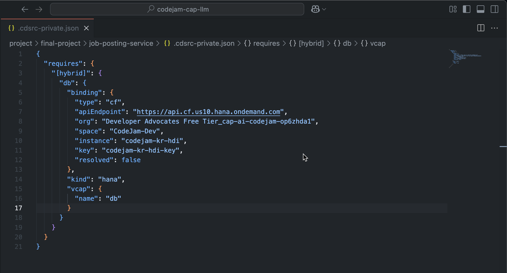

# Exercise 04 - Explore the SAP HANA Cloud Vector Engine

The SAP HANA Cloud is the leading in-memory database on the market. It is also the go-to database for CAP applications. SAP has added the the vector engine to the SAP HANA database. The vector engine provides the data foundation for a complete new set of natural and intuitive capabilities. For this CodeJam, you will use the vector engine to augment large language models with business context. Targeting this use case, the vector engine is used for two things. The engine stores relevant business data as vector embeddings and second, search for similar and relevant vector embeddings based on the user's prompts. These vector embeddings than get passed along to a defined LLM for accurate business answers using that contextual information.

The nature of a vector engine is to seamlesly work with generative AI applications. By providing the ability to store different types of data: text, images or sound in the form of vector embeddings. The vector engine can be used to pass data along together with Retrieval Augmented Generation (RAG) requests, natural language processing, image recognition, similarity searches, and recommendation systems.

For this CodeJam, the SAP HANA Cloud instance, is already initialized and configured. For detailed instructions on how to set up SAP HANA Cloud on SAP BTP follow the [SAP BTP Setup Guide](../../btp-setup-guide.md).

In this exercise, you will learn:

* What vector embeddings are.
* How to enable the SAP HANA Cloud vector engine
* How to configure your CAP application for SAP HANA deployment
* How to bind your CAP application to a new HDI instance

## What are Vector Embeddings

> "Vector embeddings are mathematical representations used to encode objects into multi-dimensional vector space. These embeddings capture the relationships and similarities between objects. SAP HANA Cloud Vector Engine will facilitate the storage and analysis of complex and unstructured vector data(embeddings) into a format that can be seamlessly processed, compared, and utilized in building various intelligent data applications and adding more context in case of GenAI scenarios."
- Vectorize your Data : SAP HANA Cloud's Vector Engine for Unified Data Excellence

## How do I enable SAP HANA Cloud Vector Engine

The SAP HANA Cloud vector engine comes bundled with the SAP HANA Cloud instance on SAP Business Technology Platform. Within your subaccount on SAP BTP, you or the global account admin, can assign entitlements for enabling the SAP HANA Cloud service plan.
Vector embeddings are just part of the supported data types for SAP HANA and can used within SQL queries and HANA operations.

## Configure the project for SAP HANA deployment

You have to configure your CAP project for SAP HANA deployment. That can simply be done by executing the `cds add hana` command. This configures deployments for SAP HANA to use the `hdbtable` and `hdbview` formats. If you add the argument of `--profile hybrid` to the command, the configuration is added to a `[hybrid]` profile in your `package.json`.

👉 Open the project in SAP Business Application Studio (BAS) or VSCode.

👉 Open a new terminal if not already open.

👉 Execute the `cds add hana --profile hybrid` command:

```bash
cds add hana --for hybrid
```


The profile `hybrid` relates to the hybrid testing scenario allowing you to run your CAP service on localhost but use a real connection to a running SAP HANA Cloud instance. You will utilize this feature in a later exercise.

👉 Open the `package.json` file in your project.

👉 Notice how there is a new section defined containing HANA related configuration:

```JSON
"cds": {
    "requires": {
      "db": {
        "kind": "hana"
      },
      "auth": "dummy",
      "destinations": true,
      "[hybrid]": {
        "db": "hana"
      }
    },
    "hana": {
      "deploy-format": "hdbtable"
    }
  }
```

## Bind local service to HANA instance for hybrid testing

At this point your CAP application knows that you want to use a SAP HANA database for persistence but it doesn't know what database instance you want to use and it also has no connection to it. You need to bind your application to the SAP HANA Cloud instance configured on SAP BTP. When you bind your application, a HDI container instance gets spun up for your application's data and a service key is being issued to authenticate against that instance.

You can use the CDS CLI to bind your application to the SAP HANA Cloud instance.
👉 Open the project in SAP Business Application Studio (BAS) or VSCode.

👉 Open a new terminal if not already open.

👉 Log into the provided Cloud Foundry instance and authenticate using the provided credentials:

```bash
cf login -a https://api.cf.us10.hana.ondemand.com
```

👉 Create a binding for your CAP application:

`cds bind -2 cap-ai-codejam-hdb:<Your-service-key-name>`

You can find the binding in form of a service key on the `cap-ai-codejam-hdb` instance on SAP BTP and in the `.cdsrc-private.json` file.



## Summary

At this point you have learned what the SAP HANA Cloud vector engine is, how vector embeddings work, how to get your project ready for SAP HANA deployment and how to bind your application to a HDI container instance. In the following exercises you will evolve your project into a fully functioning CAP AI service application utilizing SAP HANA Cloud vector engine, SAP generative AI Hub, embedding and chat LLMs.

## Further reading

* [RAG with SAP HANA Cloud Vector Engine, GenAI Hub & CAP](https://community.sap.com/t5/technology-blogs-by-sap/rag-with-sap-hana-cloud-vector-engine-genai-hub-amp-cap/ba-p/13700459)
* [SAP HANA Cloud Vector Engine: Quick FAQ Reference](https://community.sap.com/t5/technology-blogs-by-sap/sap-hana-cloud-vector-engine-quick-faq-reference/ba-p/13675212)
* [HANA Vector Engine and LangChain](https://community.sap.com/t5/technology-blogs-by-sap/hana-vector-engine-and-langchain/ba-p/13636959)
* [Retrieval Augmented Generation and Generative AI on SAP BTP
](https://discovery-center.cloud.sap/refArchDetail/ref-arch-open-ai)
* [Harnessing Generative AI Capabilities with SAP HANA Cloud Vector Engine
](https://discovery-center.cloud.sap/missiondetail/4405/4691/?tab=overview)
* [SAP HANA Cloud, SAP HANA Database Vector Engine Guide](https://help.sap.com/docs/hana-cloud-database/sap-hana-cloud-sap-hana-database-vector-engine-guide/sap-hana-cloud-sap-hana-database-vector-engine-guide?locale=en-US)
* [Start your free trial of SAP HANA Cloud](https://www.sap.com/products/technology-platform/hana/trial.html)
* [Using SAP HANA Cloud for Production
](https://cap.cloud.sap/docs/guides/databases-hana)

---

[Next exercise](../05-explore-destination-service/README.md)
