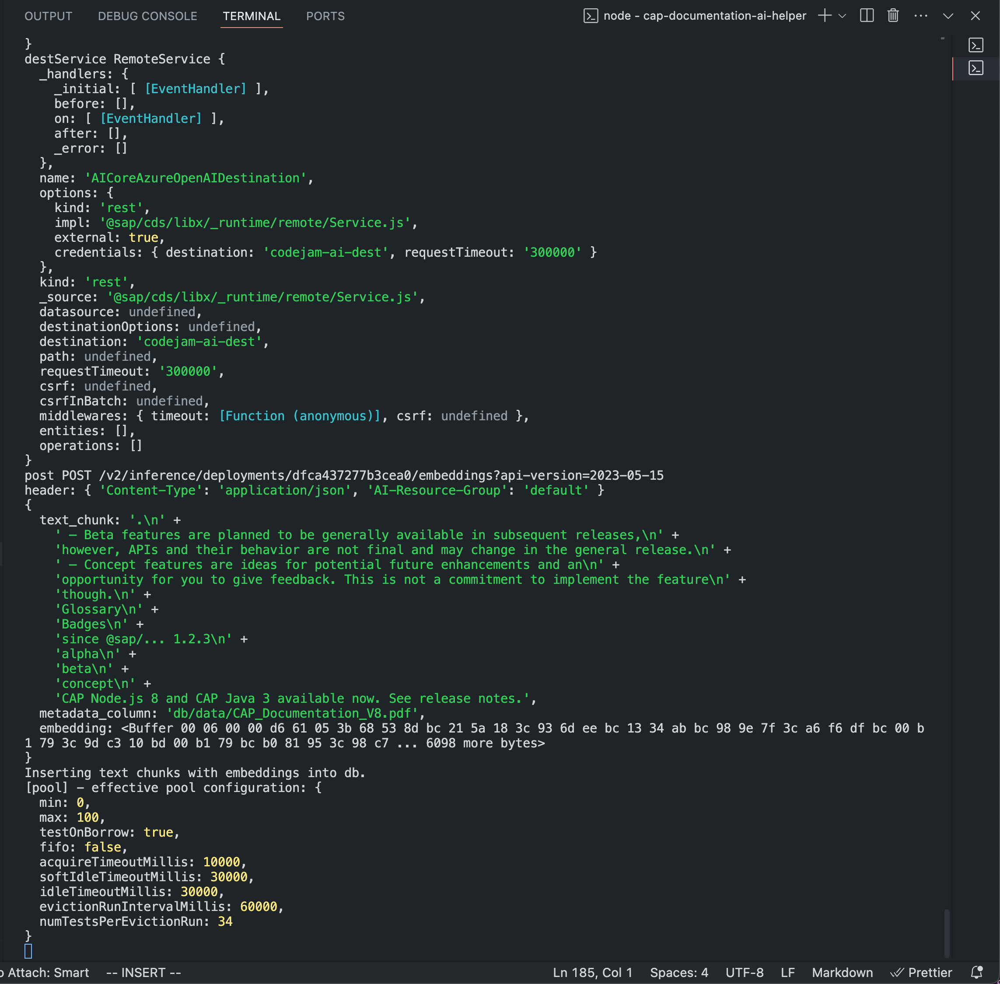
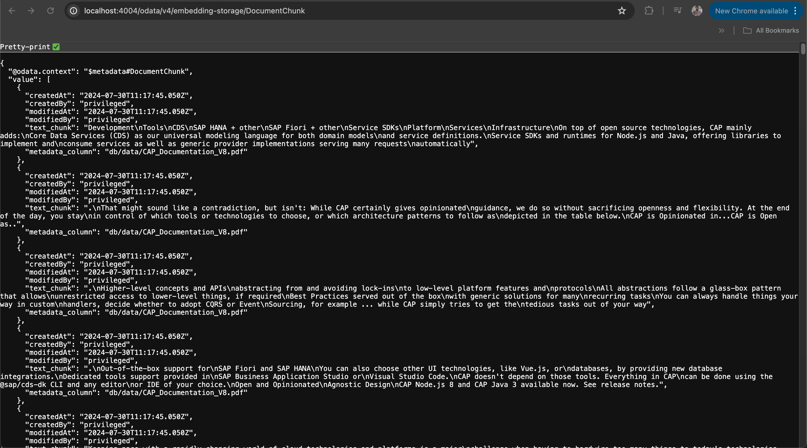

# Exercise 09 - Create the CAP-LLM-Plugin connection configuration

The CAP-LLM-Plugin uses a set of configurations to have all required information about:

* What kind of embedding model to use.
* What kind of chat model to use.
* What resource group the embedding model is in.
* What resource group the chat model is in.
* What destination to use for connecting to Generative AI Hub.

Because you could have multiple destinations configured in your CAP application you have to explicitly tell the CAP-LLM-Plugin what destination to use. The complete configuration for the destination, as well as the CAP-LLM-Plugin, can be done in the `.cdsrc-private.json` file.

In this exercise you will learn:

* How to create a destination configuration.
* How to create the CAP-LLM-Plugin configuration.
* Where to find the required information in Generative AI Hub.

## Create the destination configuration

👉 Open BAS or your local VSCode instance.

👉 Open the `.cdsrc-private.json` file.

👉 Insert the destination configuration into the JSON. Make sure it is defined in the `requires` object right after the closing bracket of the `hybrid` object array.

```JSON
{
  "requires": {
    "[hybrid]": {
      "db": {
        ...
      },
      "destinations": {
        ...
      }
    },
    "AICoreAzureOpenAIDestination": {
      "kind": "rest",
      "credentials": {
        "destination": "codejam-ai-dest",
        "requestTimeout": "300000"
      }
    },
  }
}
```

If you observe closely, the destination configuration points to the destination from the destination service on SAP BTP. The CAP-LLM-Plugin can connect to the destination service using the binding and look up the destination with the given name.

## Create the CAP-LLM-Plugin configuration

👉 Make sure there is a comma present right below the `AICoreAzureOpenAIDestination` object.

👉 Add the configuration for the CAP-LLM-Plugin right below the comma as the next object:

```JSON
"GENERATIVE_AI_HUB": {
    "CHAT_MODEL_DESTINATION_NAME": "AICoreAzureOpenAIDestination",
    "CHAT_MODEL_DEPLOYMENT_URL": "/v2/inference/deployments/<Your-Deployment-ID>",
    "CHAT_MODEL_RESOURCE_GROUP": "<Your-Resource-Group>",
    "CHAT_MODEL_API_VERSION": "2023-05-15",
    "EMBEDDING_MODEL_DESTINATION_NAME": "AICoreAzureOpenAIDestination",
    "EMBEDDING_MODEL_DEPLOYMENT_URL": "/v2/inference/deployments/<Your-Deployment-ID>",
    "EMBEDDING_MODEL_RESOURCE_GROUP": "<Your-Resource-Group>",
    "EMBEDDING_MODEL_API_VERSION": "2023-05-15"
}
```

The complete `.cdsrc-private.json` should look like this now:

```JSON
{
  "requires": {
    "[hybrid]": {
      "db": {
        "binding": {
          // ...
        },
        "kind": "hana",
        "vcap": {
          "name": "db"
        }
      },
      "destinations": {
        "binding": {
          // ...
        },
        "kind": "destinations",
        "vcap": {
          "name": "destinations"
        }
      }
    },
    "GENERATIVE_AI_HUB": {
        "CHAT_MODEL_DESTINATION_NAME": "AICoreAzureOpenAIDestination",
        "CHAT_MODEL_DEPLOYMENT_URL": "/v2/inference/deployments/<Your-Deployment-ID>",
        "CHAT_MODEL_RESOURCE_GROUP": "<Your-Resource-Group>",
        "CHAT_MODEL_API_VERSION": "2023-05-15",
        "EMBEDDING_MODEL_DESTINATION_NAME": "AICoreAzureOpenAIDestination",
        "EMBEDDING_MODEL_DEPLOYMENT_URL": "/v2/inference/deployments/<Your-Deployment-ID>",
        "EMBEDDING_MODEL_RESOURCE_GROUP": "<Your-Resource-Group>",
        "EMBEDDING_MODEL_API_VERSION": "2023-05-15"
    },
    "AICoreAzureOpenAIDestination": {
      "kind": "rest",
      "credentials": {
        "destination": "codejam-ai-dest",
        "requestTimeout": "300000"
      }
    }
  }
}
```

## Lookup the required configuration information

You can use the SAP AI Launchpad to inspect the required values. In [Exercise 04](../04-create-resource-group/README.md) you have learned how to create a resource group and deploy models to it. The information of these objects are required for the CAP-LLM-Plugin configuration.

What do you need:

* `Resource Group Name`
* `Chat Model Id`
* `Embedding Model Id`
* `API Version`

Make sure that your configuration looks something like this:

```JSON
"GENERATIVE_AI_HUB": {
  "CHAT_MODEL_DESTINATION_NAME": "AICoreAzureOpenAIDestination",
  "CHAT_MODEL_DEPLOYMENT_URL": "/v2/inference/deployments/d62bd9433f94cc13",
  "CHAT_MODEL_RESOURCE_GROUP": "default",
  "CHAT_MODEL_API_VERSION": "2023-05-15",
  "EMBEDDING_MODEL_DESTINATION_NAME": "AICoreAzureOpenAIDestination",
  "EMBEDDING_MODEL_DEPLOYMENT_URL": "/v2/inference/deployments/dfca437277b3cea0",
  "EMBEDDING_MODEL_RESOURCE_GROUP": "default",
  "EMBEDDING_MODEL_API_VERSION": "2023-05-15"
}
```

## Test the storeEmbeddings() OData function

Everything is configured to try out the `storeEmbeddings()` OData function.

👉 Open a new terminal or use an existing one.

👉 Start your CAP application by running `cds watch --profile hybrid`.

👉 Open your web browser and enter the following URL `http://localhost:4004/odata/v4/embedding-storage/storeEmbeddings()`.

👉 Inspect your terminal output to understand the single steps happening with this call. You can clearly see all the steps happening, from reading the context information to chunking and table inserts.



## Check the entries in the database.

👉 Make sure the service is still running.

👉 Open your web browser.

👉 Open `http://localhost:4040/`.

👉 Click on `DocumentChunk`.



As you can see the entities are stored in the database. With that, you can use the CAP-LLM-Plugin to execute RAG responses using vector embeddings, bringing contextual information to the chat model.

## Summary

At this point, you have implemented your first AI-focused CAP application OData service, directly exposing SAP generative AI capabilities to the outside world! Let's keep the momentum going and implement a service that allows you to retrieve an RAG response based on the context information provided within the SAP HANA Cloud vector engine.

---

[Next exercise](../10-define-cap-doc-helper-service/README.md)
